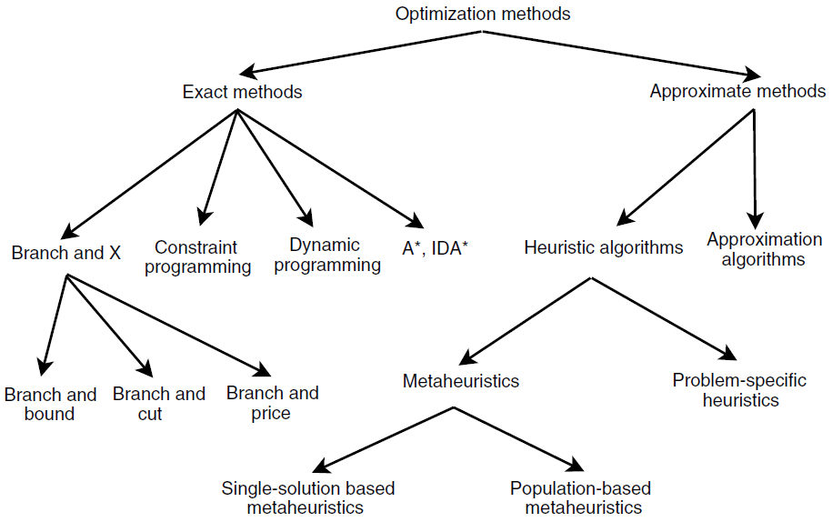

# Introduction to heuristics

Exact optimization methods generally cannot find the optimal solution of high-dimensional in reasonable time.

This way, sulutions for *combinatorial optimization problems* (COPs) such as the *traveling salesman problem* (TSP) and the *vehicle routing problem* (VRP) cannot be determined for realistic instance sizes.

## Combinatorial optimization problems (COPs)

*Combinatorial optimization problems* (COPs) are a class of optimization problems with discrete decision variables and a finite search space, although still too large for an exhaustive search to be a realistic option (Korte, Vygen, Korte, & Vygen, 2012). Many real-life problems (e.g., vehicle routing problem, scheduling problem, etc.) can be formulated as COPs.

The formal representation of a COP is as follows:

$$
\text{Minimize} \; c(x) \\
\text{subject to:} \\g(x) \geq b \\ x \geq 0, x \in f
$$

where the inequalities $g(x) \geq 0$ and $x \geq 0$  are the constraints that specify a convex polytope over which the objective function $c(x)$ is to be minimized, and  $f$ is the finite set of feasible solutions that satisfy the constraints.

A large part of COPs belong to the NP-Hard class of optimization problems, which require exponential time to be solved to optimality (Talbi, 2009).

## Heuristics

*Heuristic algorithms* are commonly used approximate methods to search for COP solutions.
They tradeoff optimality for competitive performance, allowing decision-makers to quickly find good feasible solutions using less computational effort.

Heuristics can be  furter divided into *problem-specific heuristics* and *metaheuristics*.
Figure 1 summarizes the classical optimization methods.

Figure 1: Classical optimization methods (Talbi, 2009).

## Problem-dependent heuristics

A *heuristic* is a procedure that is likely to discover a very good feasible solution, but not necessarily an optimal solution, for the specific problem being considered.
No guarantee can be given about the quality of the solution obtained, but a well-designed heuristic method usually can provide a solution that is at least nearly optimal.
The procedure also should be sufficiently efficient to deal with very large problems.

Heuristic methods tend to be ad hoc in nature: they are carefully tailored to fit a specific problem type rather than a variety of ­application.
The procedure often is a full-fledged iterative algorithm, where each iteration involves conducting a search for a new solution that might be better than the best solution found previously.
When the algorithm is terminated after a reasonable time, the solution it provides is the best one that was found during any iteration.

## Metaheuristics

A *Metaheuristic (MH)* is a general solution method that provides both a general structure and strategy guidelines for developing a specific heuristic method to fit a particular kind of problem.
Similarly to heuristics, they do not guarantee optimality, but are effective to find reasonable good solutions in different applications.

However, unlike classical or deterministic methods, MHs are not much affected by the structure of the problem: they try to improve the solution set based on the experience or on a "trial and error" approach using defined components (often stochastic) throughout the process (J. de Armas et al., 2021).

>A metaheuristic is a general kind of solution method that orchestrates the interaction between local improvement procedures and higher level strategies to create a process that is capable of escaping from local optima and performing a robust search of a feasible region.

Other authors emphasize the flexible nature of MHs. For example, the method has been defined as:

>"a high-level problem-independent algorithmic framework that provides a set of guidelines or strategies to develop heuristic optimization algorithms." — Sorensen and Glover (2013)

>an iterative master process that guides and modifies the operations of subordinate heuristics to efficiently produce high-quality solutions.
>It may manipulate a complete (or incomplete) single solution or a collection of solutions at each iteration.
>The subordinate heuristics may be high (or low) level procedures, or a simple local search, or just a construction method." — Voß et al. 1999

Typically, MHs start with randomly or pseudo-randomly generated feasible solutions and update them by conducting systematic changes by means of a given solution structure or in a sampling fashion (J. de Armas et al., 2021).

### Classification criteria

#### Nature versus non-nature inspired

**Nature inspired**: By natural processes (biology), for example:

- *Genetic Algorithm* (GA) (Holland et al., 1992),
- *Memetic Algorithm* (MA) (Moscato et al., 1989), and
- *Differential Evolution* (DE) (Storn & Price, 1997),

Swarm intelligence algorithms, such as:

- *Artificial Bee Colony* (ABC) (Karaboga, 2005),
- *Ant Colony Optimization* (ACO) (Dorigo & Blum, 2005), and
- *Particle Swarm Optimization* (PSO) (Kennedy, 2006).

**Non-nature inspired**: For example:

- *Imperialist Competitive Algorithm* (ICA) (Atashpaz-Gargari & Lucas, 2007) (society),
- *Simulated Annealing* (SA) (Kirkpatrick, Gelatt, & Vecchi, 1983) (physics), and
- *Harmony Search* (HS) (Geem, Kim, & Loganathan, 2001) (musics).

#### Memoryless versus with memory

**Memoryless**: do not use the historical information dynamically during the search process (e.g., GA , SA)
**With memory**: memorize historical information during the search process, and this memory helps to avoid making repetitive decisions (e.g., *Tabu Search* (TS) by Glover & Laguna, 1998).

#### Deterministic versus stochastic

**Deterministic**: always obtain the same final solution when starting from the same initial solution (e.g., TS).
**Stochastic**: apply random rules to solve the problem and obtain different final solutions when starting from the same initial solution (e.g., SA, GA).

#### Starting point: sigle-solution versus population based

**Single-solution based**: also known as trajectory methods, manipulate and transform a single solution to reach the (near-) optimal solution. Examples:

- *Tabu Search* (TS),
- *Simulated Annealing* (SA),
- *Iterated Local Search* (ILS) (Lourenço, Martin, & Stützle, 2003),
- *Breakout Local Search* (BLS) (Benlic, Epitropakis, & Burke, 2017),
- *Descent-based Local Search* (DLS) (Zhou, Hao, & Du- val, 2016),
- *Guided Local Search* (GLS) (Voudouris & Tsang, 1999),
- *Variable Neighborhood Search* (VNS) (Mladenovic & Hansen, 1997),
- *Hill Climbing* (HC) (Johnson, Papadimitriou, & Yannakakis, 1988),
- *Large Neighborhood Search* (LNS) (Shaw, 1998), and
- *Great Deluge* (GD) (Dueck, 1993).

**Population-based**: try to find the optimal solution by evolving a population of solutions. For example, GA, PSO, ACO, and *Water Wave Optimization* (WWO) (Zheng, 2015).

Single-solution based MHs are more *exploitation* search algorithms, having the power to intensify the search in local regions, whereas population-based MHs are more *exploration* algorithms, allowing a better diversification in the entire search space.

### Search mechanism: iterative versus greedy

**Iterative**: starts with a complete solution and manipulates it at each iteration using a set of search operators (e.g., ILS, GA).

**Greedy**: Also called constructive algorithm, starts from an empty solution and constructs the solution step by step until a complete solution is obtained. Examples:

- *Nearest Neighbor* (NN),
- *Greedy Heuristic* (GH),
- *Greedy Randomized Heuristic* (GRH), and
- *Greedy Randomized Adaptive Search Procedure* (GRASP) (Feo & Resende, 1995).

### Implementation challenges

#### Algorithm selection

There is no single MH that dominates all other MHs in solving all problem instances. Instead, different MHs perform well on different problem instances (i.e., performance complementarity phenomena) ( Kerschke et al., 2019 ).
Therefore, there is always an unsolved question as

>*"Which algorithm is likely to perform best for a given COP?"* (Rice et al., 1976).

The ideal way to find the best algorithm to solve a COP, when the computational resources are unlimited, is to exhaustively run all available algorithms and choose the best solution, no matter by which algorithm it has been obtained.

However, since it is practically impossible to test all available algorithms on a particular problem instance due to limited computational resources, research efforts have been focused instead of the question:

>"Among the existing algorithms, how to select the most appropriate one for solving a particular problem instance?"

#### Fitness evaluation

Fitness evaluation is one of the key components of MHs to guide the search process towards the promising regions of the search space.
For some optimization problems, there is no analytical fitness function by which the solutions are evaluated, or even if it exists, it is computationally expensive to evaluate.

#### Initialization strategies

The way of initializing a MH has a profound impact on its exploration and exploitation abilities. If the initial solutions are not well diversified, a premature convergence may occur, and the MH gets stuck in local optima. On the other hand, starting from low quality solutions may take a larger number of iterations to converge. Theree are three strategies for initializing MHs:

- **Random**: an initial solution is generated randomly, regardless of the quality of the solution.
- **Greedy**: a solution is initialized with a good-enough quality.
- **Hybrid**: combines random and greedy strategies.

## References

- de Armas, J., Lalla-Ruiz, E., Tilahun, S. L., & Voß, S. (2021). [Similarity in metaheuristics: a gentle step towards a comparison methodology](https://link.springer.com/article/10.1007/s11047-020-09837-9). Natural Computing, 1-23.
- Talbi, E. G. (2009). Metaheuristics: from design to implementation (Vol. 74). John Wiley & Sons.
- Karimi-Mamaghan, M., Mohammadi, M., Meyer, P., Karimi-Mamaghan, A. M., & Talbi, E. G. (2021). [Machine Learning at the service of Meta-heuristics for solving Combinatorial Optimization Problems: A state-of-the-art](https://doi.org/10.1016/j.ejor.2021.04.032). European Journal of Operational Research.
- Toth, P., & Vigo, D. (Eds.). (2014). Vehicle routing: problems, methods, and applications. Society for Industrial and Applied Mathematics.
